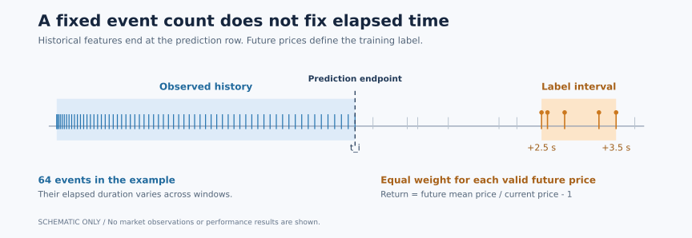

# Irregular-Time LOB Return Forecasting

[](https://github.com/Hanibote0624/lob-return-forecasting/actions/workflows/checks.yml)
**Short-horizon return regression from Level-2 order-book factors and observed event times.**

[中文说明](README.zh-CN.md) · [Project walkthrough / 项目详解](docs/project_walkthrough.zh-CN.md) · [Architecture](docs/architecture.md) · [Verification evidence](docs/evidence.md)

This project studies whether recent LOB-derived factors contain information about near-future mid-price returns. It combines a time-aware Transformer–LSTM with explicit rules for label construction, chronological splits, window sampling and prediction alignment.

**Status:** research portfolio; the V6 implementation is preserved in this V7 documentation release. Recorded synthetic and component checks passed. A clean real-data GPU experiment and historical result reproduction remain pending. Market data and trained research checkpoints are not distributed.

## The task

| Item | Public example |
| --- | --- |
| Input | 109 precomputed factors from irregularly spaced market events |
| Lookback | 64 consecutive events within one session, subject to history-time limits |
| Time input | Elapsed seconds from the first event in each window |
| Target | Return to the **event-average** reference price over the next **2.5–3.5 seconds** |
| Model | Train-set standardization → projection + sinusoidal time encoding → Transformer → LSTM → scalar head |
| Training | TensorFlow on GPU; weighted CCC by default, currently restricted to one replica |
| Validation | Chronological date splits; early stopping on unweighted validation Pearson correlation |

Values above are configuration choices, not measured performance. The current implementation is a **single-target regressor**. Existing factors are supplied in the raw data; their private definitions are not reconstructed here.



*Conceptual illustration, not market observations or a backtest. A fixed event count does not imply a fixed duration. The future interval is used to construct labels, never as model input.*

## What the implementation makes explicit

- **Event time:** timestamps remain float64 until window-relative times are formed. Time encoding uses elapsed seconds rather than assuming evenly spaced observations. Mixed-policy regression checks cover millisecond differences.
- **Target meaning:** valid future prices have equal weight in the label interval. Missing future coverage is invalid rather than a zero return. Scaling and clipping use explicit configuration and training-only statistics.
- **Training–inference consistency:** packing and raw-CSV inference share feature preprocessing. Predictions carry original endpoint rows and timestamps, so evaluation checks alignment instead of truncating arrays.
- **Experiment identity:** label definitions, scaling and statistics are bound to packs, models and predictions. Consumers reject missing or mismatched contracts, including old artifacts with the same horizon name.

See [architecture and trade-offs](docs/architecture.md), [label rules](docs/data_contract.md) and [inference/backtest rules](docs/inference_and_backtest_contract.md).

## Evidence and limits

The recorded V6 checks and the hosted CI run below provide evidence for specific implementation behaviors, not forecasting quality. V6 source fingerprints match the implementation in this release.

| Evidence | What was checked | Boundary |
| --- | --- | --- |
| [80 non-TensorFlow tests](docs/verification/v6_checks_summary.json) | Labels, time precision, chronological configuration, packing, alignment, failure propagation and backtest rules | Synthetic fixtures and selected regression cases |
| [Complete synthetic Stage1–5 runs](docs/verification/v6_synthetic_summary.json) | Every generated label and eligible window against independent references; held-out changes leave training statistics unchanged | Eight synthetic sessions per case; no predictive-performance estimate |
| [13 model/integration tests](docs/verification/v6_model_components.json) | Weighted losses/metrics, float32 and mixed-bfloat16 arithmetic, save/load, prediction generation/reuse and evaluation | Small CPU checks with a temporary model fixture; not a Stage6 GPU research run |
| [Hosted CI](https://github.com/Hanibote0624/lob-return-forecasting/actions/runs/35343126972) | Development checks, synthetic Stage1–5 integration, shell syntax and configuration dry-run | Passed for commit `57b1ead`; excludes TensorFlow model tests and GPU training |
| GPU acceptance | Separate verification command provided | GPU success path remains unverified |

No current-version test-set IC, directional accuracy, trading return or superiority over LightGBM is claimed. The [evidence guide](docs/evidence.md) maps each claim to its source and explains what would be needed for a research-result claim.

## Review the project

For a short code review, start with:

| Question | Entry point |
| --- | --- |
| What exactly is predicted? | [`src/data_contract.py`](src/data_contract.py) |
| How does elapsed time enter the model? | [`src/stage6_train_regression.py`](src/stage6_train_regression.py) |
| How are stale targets detected? | [`src/target_contract.py`](src/target_contract.py) |
| How are packed and inference features kept consistent? | [`src/feature_preprocessing.py`](src/feature_preprocessing.py) |
| How is correctness checked independently? | [`scripts/synthetic_data.py`](scripts/synthetic_data.py), [`tests/test_synthetic_pipeline.py`](tests/test_synthetic_pipeline.py) |

The [project walkthrough](docs/project_walkthrough.zh-CN.md) explains the design in Chinese and links to the relevant code.

## Inspect or verify locally

From the repository root, Python 3.12 can inspect the configuration and commands without data, TensorFlow or a GPU:

```bash
python scripts/run_pipeline.py --config-path config/gp_lit_regression_v6_gpmain_64.example.json --dry-run
```

In a separate development environment, run the lightweight checks:

```bash
python -m pip install -r requirements/dev.txt
python scripts/check.py
```

For one retained synthetic preparation run, use a **new** output directory:

```bash
python scripts/check_synthetic_pipeline.py --output-dir local/synthetic-review
```

See [environment setup](docs/environment.md) for Linux/WSL and PowerShell commands, and [model verification](docs/model_verification.md) for the separate TensorFlow component suite. These checks do not enable CPU research training.

## Research workflow

The main path is **manifest → labels → pack → windows → healthcheck → train → predict → evaluate**. It is launched by `scripts/run_pipeline.py`; `run_all.sh` wraps the same runner. A failing stage stops the selected sequence.

The public example uses one stock, existing factors and no cross-stock factor normalization. Stage0 enrichment and LightGBM comparisons remain outside the default pipeline. Stage1.5 scale auditing and the research backtest are optional. Core train-set feature standardization still applies in single-stock runs.

A real run needs private data, a separate `*.local.json`, a compatible GPU environment and a new run name. Follow the [research runbook](docs/research_runbook.md). When migrating from historical/V5 artifacts, rebuild Stage2–5 and retrain; changing metadata or using `--only-scale` does not upgrade old models.

## Interpretation and next validation

Elapsed-time encoding makes timing available to the model; its predictive benefit still needs ablation. Chronological splits and training-only statistics address specific leakage risks; the causality of externally supplied factors also needs independent verification.

The optional backtest uses validation-calibrated thresholds and bid/ask prices, but assumes same-row signal execution and omits latency, fill uncertainty, queue position and market impact. Its cumulative trade-return sum is not a capital-based equity curve.

The next research milestone is a clean GPU run, followed by matched baseline/time-encoding ablations and reporting across sessions and time periods. Historical metrics remain separate until data, labels, checkpoints and evaluation rules can be matched.

## Documentation

- [Architecture](docs/architecture.md) · [Evidence](docs/evidence.md) · [Configuration](config/README.md)
- [Runbook](docs/research_runbook.md) · [Development](docs/development.md) · [Environment](docs/environment.md)
- [V7 documentation notes](docs/v7_release_notes.zh-CN.md) · [V6 technical changes](docs/v6_release_notes.zh-CN.md)

The repository is prepared for portfolio review. No open-source license has been added. Data, trained artifacts and local configuration are excluded from the public package.
