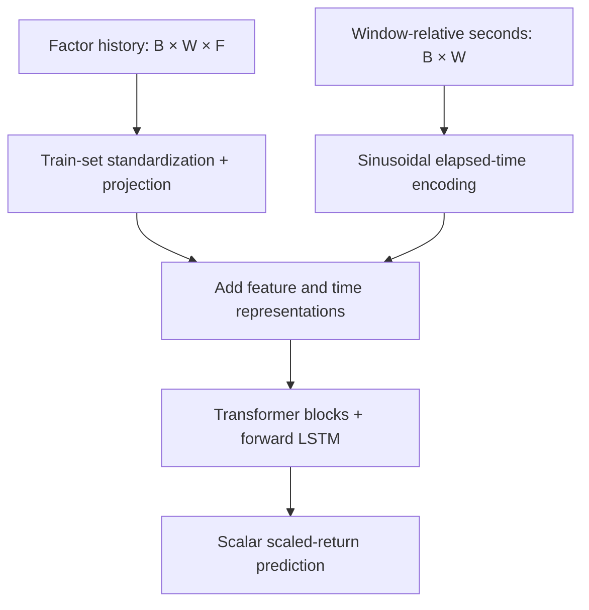

# Architecture and research choices

[English README](../README.md) · [中文说明](../README.zh-CN.md) · [Evidence](evidence.md)

The current public implementation predicts one scaled return per historical window. The example uses **W=64 events**, **F=109 factors**, and a **2.5–3.5 second future interval**. These dimensions are configurable. This version uses additive sinusoidal elapsed-time encoding, not RoPE or a multi-task output head.

## How time enters the model

Absolute event times are stored as float64. The loader subtracts each window's first timestamp before converting relative seconds to float32. For elapsed time `tau`, the encoding uses `sin(time_scale * tau * frequency)` and `cos(...)`; `time_scale=100` in the example. It supplies time information but does not establish that the model uses it profitably.

`FixedStandardize` and the phase calculation protect float32 arithmetic before mixed-policy layers can discard small differences. The regression head also outputs float32. The example defaults to float32; separate small tests exercise `mixed_bfloat16`.

Self-attention is unrestricted inside the observed historical window. This does not expose future target rows: all inputs end at the prediction endpoint. The model is not an online recurrent state machine; raw inference evaluates bounded batches of rolling windows.

## Data and artifact boundaries

| Stage | Role | Important output or check |
| --- | --- | --- |
| Stage1 | Discover sessions, validate columns, assign configured date splits | Session index and ordered factor schema |
| Stage2 | Build future event-mean returns; estimate train-only quantiles; scale/clip labels | Raw/final labels, validity masks, target definition and source fingerprints |
| Stage3 | Apply shared preprocessing; pack rows; estimate train-only feature statistics | Arrays, per-session segments, schema and statistics |
| Stage4 | Enumerate usable endpoints without crossing sessions | Block/endpoint manifest, history-time constraints |
| Stage5 | Validate manifest structure and sample array/window values | Strict health-check report; not an exhaustive production-data certificate |
| Stage6 | Construct the model, fit on GPU and select validation-Pearson weights | Model, weights, logs, configuration and model contract |
| Prediction/evaluation | Predict from raw CSVs and align with labels | Explicit endpoint rows/times and contract-checked diagnostics |

The main runner executes these stages in dependency order and stops on failure. Selecting only some stages requires their prerequisites to exist; this is not automatic training resumption. Failed stages can leave partial outputs that need rebuilding.

## What is learned from which split?

| Quantity or decision | Source |
| --- | --- |
| Label q90 for training weights; q99 for clipping | Training sessions only, using configured per-session sampling |
| Feature mean and standard deviation | Training rows only; the example selects rows with valid labels |
| Model weights | Training windows |
| Best checkpoint | Unweighted validation Pearson correlation |
| Default optional backtest thresholds | Prior validation split; held fixed on test |
| Final test diagnostics | Test prediction rows with valid aligned labels |

Raw labels are retained alongside scaled/clipped targets. A model output is in **scaled, potentially clipped return units**. Dividing it by the multiplier does not reverse clipping or guarantee calibration to raw returns.

Training endpoints need valid labels and positive sample weights. Raw prediction uses historical-window availability, without requiring future labels. Offline evaluation subsequently filters by label validity. This keeps future availability out of the inference decision.

## Target identity across artifacts

`src/target_contract.py` records the actual interval, reference-price policy, event-mean aggregation, validity rules, precision, scale, clipping and calibration settings. Its canonical JSON fingerprint and the exact label-statistics file fingerprint propagate through the main artifact chain. Raw labels also record the source CSV fingerprint.

Matching a horizon string is insufficient. Consumers compare the recorded definition and fingerprints before combining artifacts. This protects against accidental mixing; it is not a security signature and does not hash every packed array byte. Even a regenerated statistics file with identical numbers can require downstream regeneration because the exact file fingerprint changes.

## Optional and historical paths

| Path | Relationship to the main experiment |
| --- | --- |
| Stage0 baseline/enrichment | Optional extra-factor experiment; not launched by the default runner |
| Stage1.5 factor-scale audit | Opt-in multi-stock experiment; unnecessary for the default single-stock configuration |
| LightGBM comparison | Separate comparison script; no verified matched-result table is published |
| Alternative tick-based labels | Historical utility; different task definition and outside the audited main path |
| Flip backtest / visualization | Optional research diagnostics with simplified execution assumptions |

The absence of cross-stock normalization does not remove train-set feature standardization. Supplied factor columns must also be audited for their own causal construction; downstream split checks cannot establish that property.

## Choices that remain empirical questions

The Transformer–LSTM is a research hypothesis, not an established best model. Meaningful next comparisons use the same source sessions, target definition, eligible endpoints and validation procedure: constant/linear baselines, a matched LightGBM comparison, time encoding disabled, and LSTM aggregation replaced by pooling. The code exposes relevant model switches; matched real-data results are not yet available.

CCC emphasizes agreement of means, variances and covariance within a weighted batch. It is restricted to one replica in this implementation; a mean of replica-local CCC losses is not the CCC of the combined batch. MSE, Huber and LogCosh are selectable. Small numerical/save-load tests are evidence of implementation behavior, not loss superiority.

See [model verification](model_verification.md) for constant-target and zero-weight metric policies, checkpoint semantics and remaining GPU boundaries.
